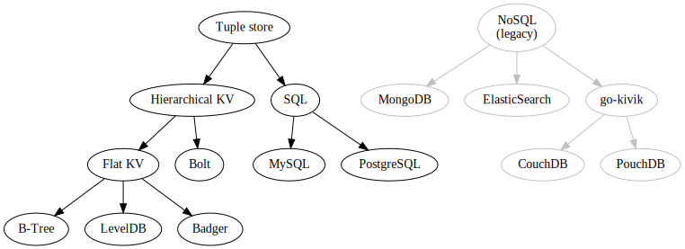

# HiDAL-Go

HiDAL-Go = **Hi**gh-level **D**atabase **A**bstraction **L**ayer for **Go**

This library consists of multiple abstraction layers over existing databases,
either embedded or not.

Diagram of available implementations:

The unique feature of this library is that backends with lower abstraction levels
(e.g. key-value stores) can implement higher abstraction levels (e.g. tuple store).

It is also possible to go in the other direction: given a tuple store (e.g. SQL),
it is possible to "downgrade" it to a KV store. The KV abstraction will be the same
as if a regular KV store is used.

See [docs](docs/README.md) for more details on available implementations.
