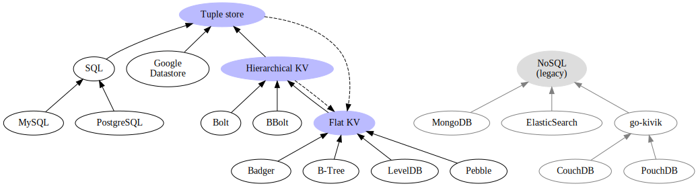

# UDA

Unified Database Adapters for Go.

This library consists of multiple abstraction layers over existing databases.

Diagram of available implementations:

See [docs](./docs/README.md) for more details.
